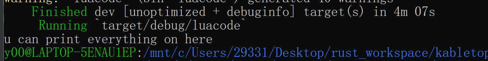
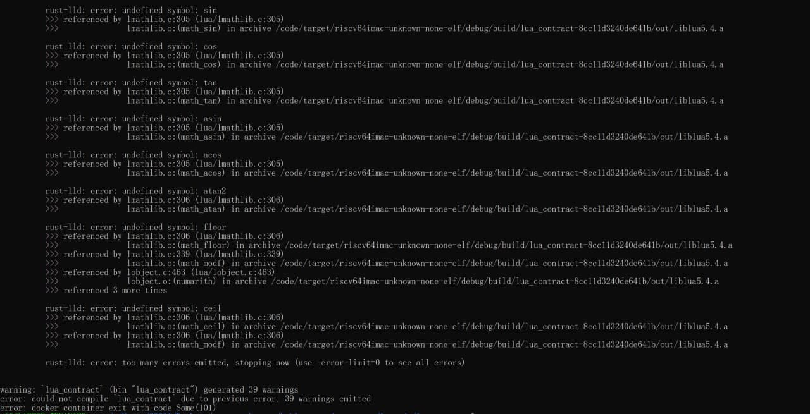

# rust_luacode

### task 
- 前期初步调研。相关方案，技术路线调研。
- [x]  采用语言，lua、nim、mruby和mpython 等一切可以生成rv二进制文件的语言
- [x]  在本地采用基于wsl的ubuntu系统，进行x86到rv的跨平台编译
- [x]  kabletop和相关项目的调研
- [x]  整理进行合约扩展大致思路，分为vm的实现、调用部分、mvp系统、high-level部分扩展等四大模块。逐步进行
- [x]  整理研究记录和工作日志
- lua vm的实现。基于ckbvm的riscv架构实现lua解释器，可以编译lua语言或其他语言的合约。
- [x]  riscv-gcc工具链、riscv-tool以及用于编译成二进制文件的gcc-riscv的配置和学习
- [x]  学习并实践c库的链接、c语言到rv二进制文件编译、编译器选项等等知识
- [x]  在本地实践c语言高级代码编译成rv文件并在riscv-tool提供的模拟器环境上测试运行
- [x]  配置lua环境
- [x]  学习lua解释器编译到riscv架构的原理
- [x]  基于c库和lua解释器在本地编译生成lua静态liblua.a库文件并实践lua和c语言的互操作
- [x]  学习Lua解释器在不同kernel和环境上的移植原理
- [x]  基于lua解释器将之改进到能跨平台从x86_64-linux-gnu编译到target riscv64-unknown-elf-gcc
- 调用与rust集成部分。在已有合约基础上，通过rust合约调用，完成一些功能性命题，诸如数据检验，等等。
- [x]  探索rust中调用lua的方案
    - [x]  基于luajit的In-Time编译整合 Rust 与 Lua
        - [x]  学习rust ffi原理和luajit基础
        - [x]  尝试基于rust ffi 与luajit 在本地实现运行 example.lua ，但luajit尚不支持rv目标平台
    - [x]  基于rust binding整合 Rust 与 Lua
        - [x]  调研可用的binding，包括lua, hlua 和 rlua
        - [x]  基于rlua库，构建样例在rust中调用lua。但rlua中使用了大量no std方法，不能在ckb scripts中使用
- [x]  经过思考斟酌，计划基于rlua抽象出一个最小代码，能在rust中调用lua code，形成闭环
    - [x]  再次深入学习rust ffi的知识与Rust 交叉编译与条件编译知识
    - [x]  基于rust [build.rs](http://build.rs) 学习编译前操作，并调用第三方C/C++库，在本地的cargo工程中整合之前实现的lua vm，编译成指定目标类型二进制包，从而完成rust集成lua解释器的部分
    - [x]  进行rust中调用luavm读取lua code的设计。基于rlua的ffi进行改进，lua状态机构建，基于instance进行方法注册，抽象highlevel函数，实现lua code的打印
    - [x]  在lua code可以打印的基础上，将部分引用的string和vec等在no-std下非法的类型在core中找替换类型，但部分const类型转换后影响解释器，底层编译错误
- mvp系统。实现单一功能的抽象，完成链下测试与测试网部署等等工作。
- high-level部分扩展。

### work on std env 

use lua_demo_local for a cargo proj, ples prepare your cross-compile toolchain for rv, then build proj 

you will see the luacode finished by lua_vm 

### work on contract env 

use lua_contract for a capsule proj, ples prepare your ckb contract env and docker started, then build proj 

you will see the failure because of the convert from some constant values in ffi code 

